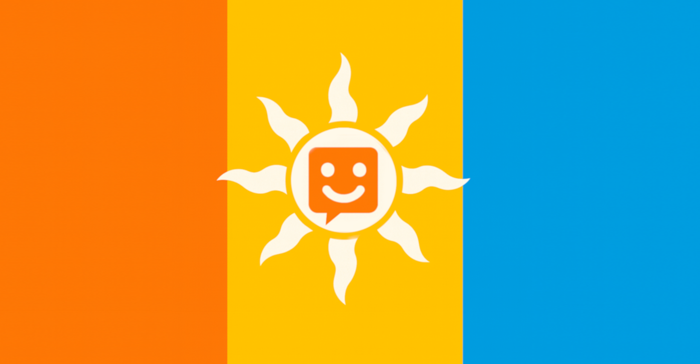

# Sorantoki (lit. sun speak)

Sorantoki is a deliberately minimal auxiliary language and governance framework designed to explore how languages can be made **learnable, inclusive, and resilient over time**.

It is not presented as a finished solution or a universal replacement for existing languages. Instead, Sorantoki is a **reference implementation**: a working language accompanied by explicit rules for how it grows, who decides, and how authority transitions from a single founder to a community.

---

### **What makes Sorantoki different**

Most constructed languages focus on grammar and vocabulary. Sorantoki focuses equally on **how a language evolves once people begin to use it**.

Sorantoki combines three elements that are rarely designed together:

1. **Structural simplicity with predictable constraints**

   * No inflection or irregular forms
   * Fixed word order and a six-slot serial verb template
   * A small phoneme inventory with no consonant clusters

2. **Inclusive design as an engineering constraint**

   * Multiple pronunciation variants are equally correct
   * Single stress rule, no lexical stress
   * Optional clarity markers instead of mandatory precision
   * A cultural repair word (*wasa*) that normalizes misunderstanding

3. **Explicit governance before community scale**

   * A friction-based process for adding new words
   * Domain balancing to prevent lexical capture
   * Transparent decision rationales
   * Defined transition from founder stewardship to community governance

Sorantoki treats language not as a static artifact, but as a **shared system that must remain usable by real humans over time**.

---

### **Design goals (and non-goals)**

**Sorantoki aims to:**

* Minimize cognitive load for learners
* Reduce barriers caused by accent, speech variation, or working-memory demands
* Encourage calm, cooperative communication
* Grow vocabulary only when communicative need is demonstrated
* Remain inspectable, and governable

**Sorantoki does not aim to:**

* Maximize expressive density
* Replace natural languages
* Compete ideologically with existing auxlangs
* Enforce a single “correct” accent or register

---

### **Inclusivity by design**

Sorantoki does not claim universal accessibility. Instead, it deliberately reduces known sources of linguistic friction that disproportionately affect some speakers, including:

* Phonological precision requirements
* Memorization of inflectional paradigms
* Irregular stress and pronunciation rules
* Social stigma around “incorrect” speech

These choices are documented openly so they can be evaluated, challenged, and improved.

---

### **Governance and growth**

Sorantoki begins with a small core vocabulary and expands only in response to repeated communicative friction.

New roots are added when:

* Existing circumlocutions are demonstrably insufficient
* The concept is broadly useful
* The addition does not distort domain balance

All decisions are documented, attributed, and subject to future review. A formal governance charter defines how decision-making authority transitions from the creator to a rotating, accountable community body once participation thresholds are met.

Sorantoki is designed so that **no single person permanently owns the language**, including its creator.

---

### **Current status**
> Sorantoki is currently a personal research project of Lionel Coombes.  
> No legal entity exists yet; all assets are held in trust for the community.  
> Governance procedures are published for transparency only and create no legally binding obligations until an NPC (or equivalent) is formed.
> Participation, contribution, or reliance on these documents is voluntary and at the participant’s own discretion.

* Early public release
* Core grammar and lexicon established
* Bootstrap governance phase active (see [governance](https://github.com/setvir/sorantoki/tree/main/governance) for details.)
* Community growth intentionally slow

This is a language being grown carefully, not rapidly.

---

### **How to get involved**

At this stage, the most valuable contributions are:

* Reading and testing the language
* [Logging points of communicative friction](https://github.com/setvir/sorantoki/discussions/categories/friction-reports)
* Writing short example texts
* Reviewing governance assumptions

Root proposals are intentionally limited during the bootstrap phase.

## Your First Word

wasa
pronounced wasa, vasa, watha, or vatha — means "I didn't catch that" or "The message wasn't received clearly." It can refer to unclear hearing, unclear speech, or simply unclear understanding.

wasa is a gentle, non-blaming way to ask someone to repeat, slow down, or clarify. It signals cooperation, not error. In Sorantoki culture, communication is shared responsibility: if something isn't understood, the listener uses wasa without hesitation, and the speaker repeats without feeling corrected.

[Grammar]([sorantoki.pdf](https://github.com/setvir/sorantoki/blob/main/grammar/Sorantoki%20Grammar.md))

____

# Github Discussions

[Discuss Sorantoki](https://github.com/setvir/sorantoki/discussions)

____

# Funding Serontoki's Vision
Backabuddy funding for Sorantoki legal registration (Dutch Stichting), hosting, domain registration and general administration:

[Fund Sorantoki Startup Costs](https://www.backabuddy.co.za/campaign/sorantoki)

## Thank me (the creator personally) for the work
PayPal / Ko-fi tips go to Lionel personally and are **not** project donations; they are simply a way to say “thanks” and may be used for coffee, rent, or whatever else.

[paypal.me](https://www.paypal.com/paypalme/sorantoki)

[ko-fi](https://ko-fi.com/serontoki)

____

[Facebook Group](https://www.facebook.com/groups/1160745382941047)

[r/sorantoki](https://www.reddit.com/r/sorantoki/)
____

By using, copying, or redistributing any Sorantoki material you agree to the terms below.

---
# Sorantoki Licensing & Trademark Notice

## 1. Speaking, Writing & Creation (the language itself)
**Scope:** all individual words (roots), affixes, grammar rules, example sentences, phonotactics, and any other linguistic facts that you need to speak, write, sing, film, or otherwise create in Sorantoki.  
**Licence:** CC0 1.0 Universal – public domain dedication.  
No attribution or permission is ever required for any purpose (personal, artistic, educational, or commercial).  
To the extent that moral rights cannot be waived under applicable law, the Creator irrevocably licences such rights on a perpetual, worldwide, royalty-free basis to the maximum extent permissible.

---

## 2. Grammar Reference & Explanatory Materials
 
**Licence:** Creative Commons Attribution-ShareAlike 4.0 International (CC-BY-SA 4.0).  
You may:
- create and sell derivative learning materials, courses, books, or apps;  
- share and adapt the content for any purpose.  

**Conditions:**
1. Give appropriate credit:  
   `Sorantoki Grammar © 2025 Sorantoki Project, licensed under CC-BY-SA 4.0`  
   (replace 20XX with the year shown in the file header).  
2. Provide a link to [https://sorantoki.org](https://github.com/sorantoki/) and to this licence.  
3. License your derivative under the same CC-BY-SA 4.0 licence.  
4. Clearly indicate that your work is unofficial.  

**Additional restriction on the *canonical* copy:**  
The official HTML/Markdown/PDF files hosted at https://github.com/sorantoki/sorantoki must remain freely accessible and may not be placed behind a pay-wall. This restriction does **not** apply to derivative works you create.

---

## 3. Official Lexicon
 
**Licence:** Creative Commons Attribution 4.0 International (CC-BY 4.0).  
You may:
- create and sell derivative works (flash-card apps, annotated dictionaries, teaching tools);  
- share and adapt the lexicon for any purpose.  

**Conditions:**
1. Give appropriate credit:  
   `Sorantoki Lexicon © 20XX Sorantoki Project, licensed under CC-BY 4.0`  
   (replace 20XX with the year shown in the file header).  
2. Provide a link to [https://sorantoki.org](https://github.com/sorantoki/) and to this licence.  
3. License your derivative under CC-BY 4.0 (or later).  

**Additional restriction on the *canonical* copy:**  
The official files hosted at https://github.com/sorantoki/ must remain freely accessible and may not be placed behind a pay-wall. This restriction does **not** apply to derivative works you create.

---

## 4. Governance Documents

**Licence:** CC0 1.0 Universal – public domain dedication.  
No attribution is legally required, but citing the source is appreciated.

---

## 5. Trademarks
The word **“Sorantoki”** and the official Sorantoki logo are unregistered trademarks ™ of the Sorantoki Project.  
You may use them **only** to refer to the language itself or to official resources.  
Fair-use for descriptive titles (e.g., “Learning Sorantoki”) is allowed, provided the work is primarily about the language and does not falsely imply official endorsement.

---

## 6. No Warranties
All materials are provided “as-is” without warranty of any kind, express or implied, including but not limited to the accuracy of lexical definitions or grammatical descriptions.
